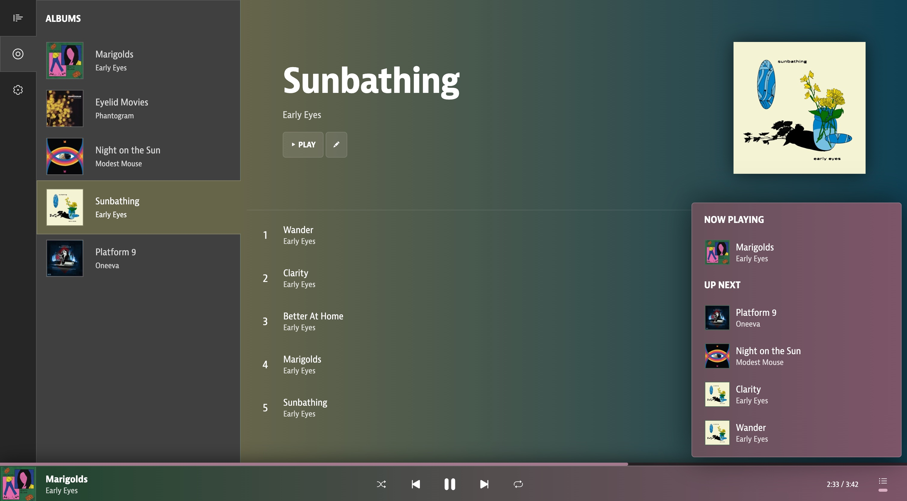

# Marigold
## The stylish music locker meant to enhance your music listening experience

## Marigold is currently under development!
This means that Marigold is NOT READY for use yet. Security flaws, explosive bugs, and many sad faces may be encountered if you try to actually use it in its current state. In fact, the only way to currently use Marigold is to download and host it yourself (instructions coming soon...)

## Development Plans
### THINGS DONE:
- [x] Full rewrite for increased maintainability
- [x] Migration to PocketBase
- [x] Fully responsive UI
- [x] Color palette generator built from scratch using OKLAB color space
- [x] Immersive listening mode
- [x] User accounts

### TOP PRIORITY:
- [ ] File uploading
- [ ] Editor mode - Creating and modifying albums, playlists, artists, etc...
- [ ] New portfolio demo

### SOON:
- [ ] File metadata integration (your music tags work with Marigold)
- [ ] Downloading your entire library
- [ ] Support for various stream qualities with FFMPEG
- [ ] Desktop application with Tauri

### SOMEDAY:
- [ ] iOS app
- [ ] Android app

### PIPE DREAM:
- [ ] Integration with a music vendor (i.e., Bandcamp) to make it easy to buy and port songs directly into Marigold
