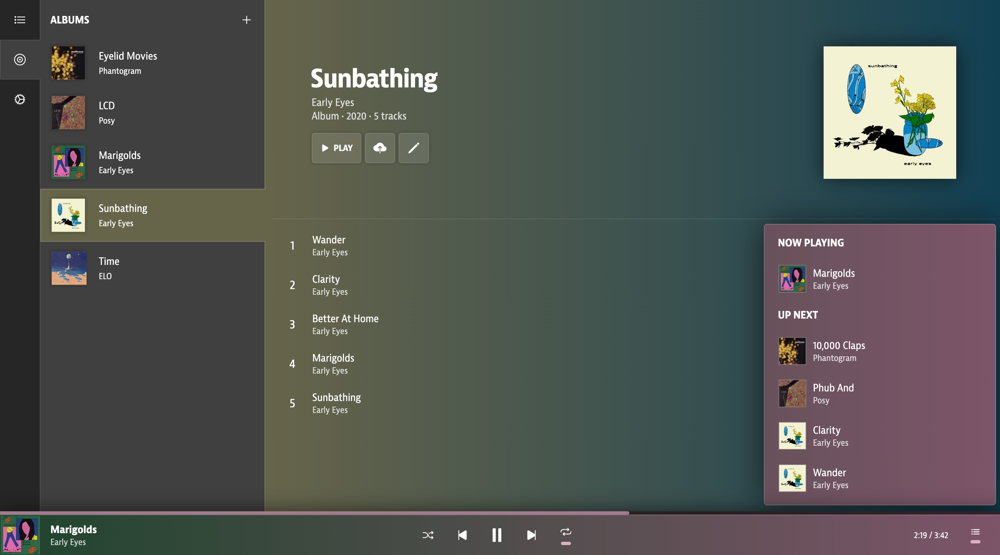

# Marigold
A modern music locker.

## Marigold is currently under development!
Here be dragons. A demo of the application will be up soon!

## Development Plans
### THINGS DONE:
- [x] Full rewrite for increased maintainability
- [x] Migration to PocketBase
- [x] Fully responsive UI
- [x] Color palette generator built from scratch using OKLAB color space
- [x] Immersive listening mode
- [x] User accounts
- [x] File uploading

### TOP PRIORITY:
- [ ] New portfolio demo
- [ ] File metadata integration (your music tags work with Marigold)

### SOON:
- [ ] Desktop application with Tauri
- [ ] Downloading your entire library

### SOMEDAY:
- [ ] Support for various stream qualities with FFMPEG
- [ ] iOS app
- [ ] Android app

### PIPE DREAM:
- [ ] Integration with a music vendor (i.e., Bandcamp) to make it easy to buy and port songs directly into Marigold
